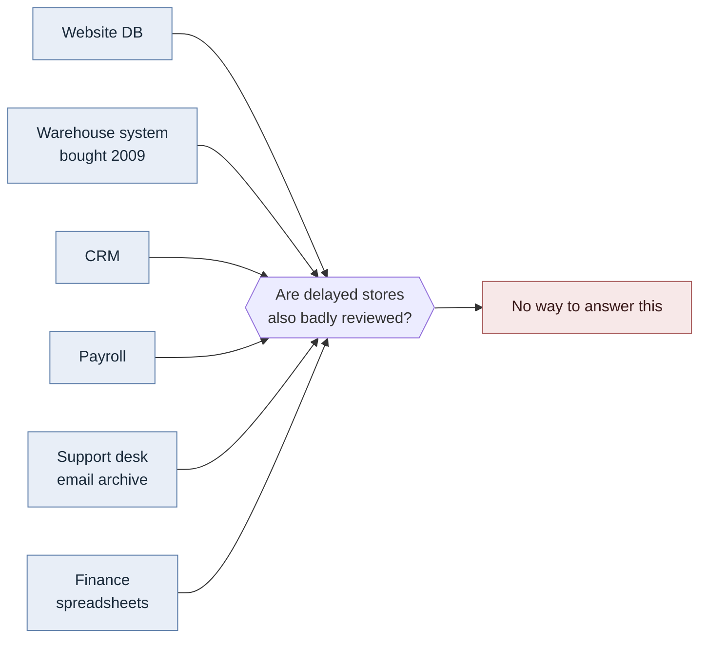
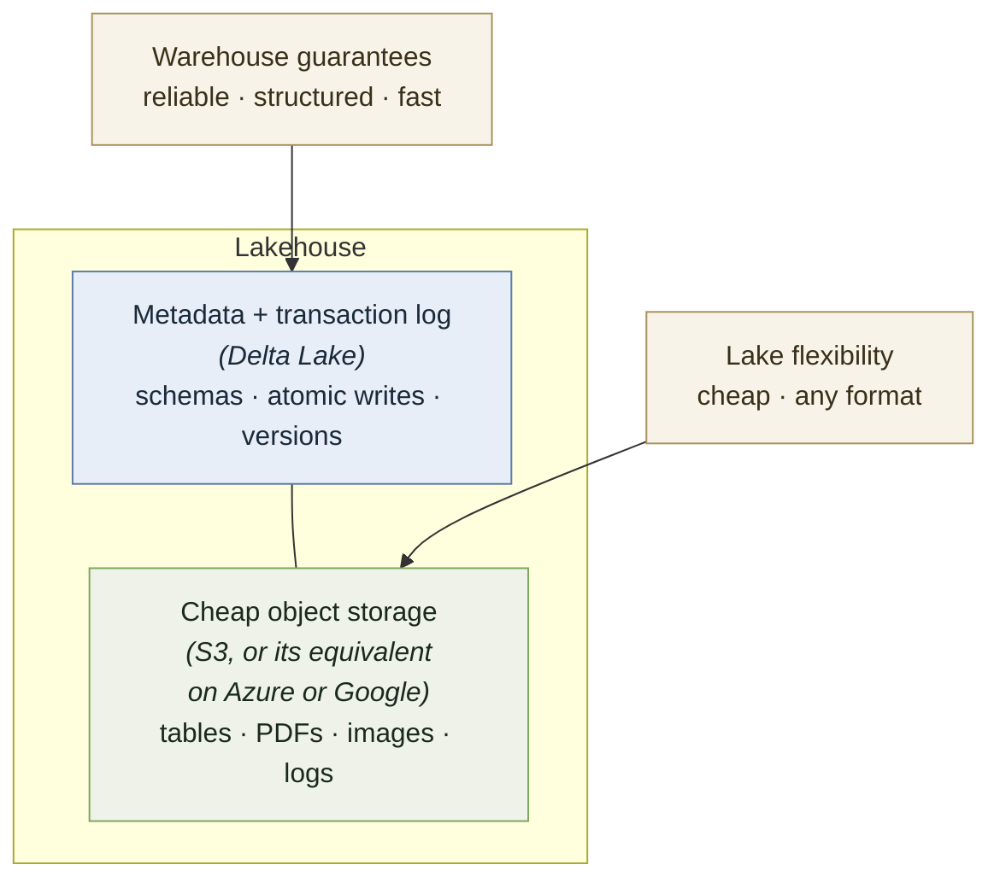
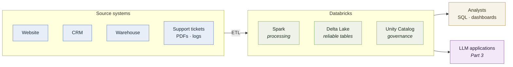

# Part 1 — What Databricks is and how it works

*Reading, no hands-on yet. About 3–4 hours.*

Everything here is anchored to the one thing you almost certainly know already: a single
relational database like MySQL or PostgreSQL, holding tables for one application. Every
new idea in this part is introduced as a specific departure from that.

---

## 1.1 What "enterprise" actually means

You'll see the word *enterprise* everywhere in this field. It isn't a synonym for "big
company." It describes a **situation**:

- many teams, who don't all talk to each other
- many systems, built at different times, by people who have since left
- real money and real regulators attached to getting things wrong
- decisions made fifteen years ago that you inherit and cannot undo

Picture one company. A retailer: a website, 400 physical stores, a warehouse management
system bought in 2009, a system for tracking customers, a payroll system, and a support
desk where people email about broken orders.

Six systems. **None of them were designed to talk to each other.** Each was bought or
built by a different team, in a different decade, to solve one problem well. The website
knows about orders. The warehouse system knows about inventory. The support desk knows
about complaints. Nobody knows about all three at once.

Now the head of the retail division asks a question:

> "Are the stores that had shipping delays last quarter also the ones getting the worst
> customer reviews?"

That question spans three systems. There is no query you can write that answers it. Not
because it's technically hard, but because the data lives in three places with three
different ideas of what a "store" is.

**This is the problem. Everything in this guide exists to solve it.**

### Enterprise software vs. what you wrote in school

Your projects had a clean schema you designed, one database, and a user who was you. You
could change anything at any time.

Enterprise software has:

- **permissions** — most people must not see most of the data
- **auditing** — a record of who saw what, and when, because someone will eventually ask
- **compliance** — legal rules about how certain data is stored, who can access it, and
  when it must be deleted
- **uptime commitments** — if it's down, people can't work and money is lost
- **twenty years of prior decisions** you have to work around

None of that is more intellectually difficult than what you did in school. It's just a
completely different set of constraints, and it's why enterprise tools look strange at
first — they're solving problems your coursework didn't have.

### Vocabulary you'll hear constantly

Defined once, plainly, so nothing later is mysterious:

| Term | What it means |
|---|---|
| **Enterprise** | A large organisation with many teams and systems — and the situation described above |
| **Fortune 500** | The 500 largest US companies by revenue. Shorthand for "very large company" |
| **CRM** | Customer Relationship Management — software tracking customers and sales. Salesforce is the famous one |
| **ERP** | Enterprise Resource Planning — software running core operations: finance, inventory, HR |
| **Line-of-business system** | Any system a specific department depends on to do its job |
| **Legacy system** | Old software that still works and still matters, which nobody wants to touch |
| **Vendor** | A company that sells you software. Databricks is a vendor |
| **Platform** | Software other software gets built on top of |
| **SaaS** | Software as a Service — you rent it and access it over the internet rather than installing it |
| **Procurement** | The formal process of buying software. Slow, and a reason companies standardise on few vendors |
| **"The business"** | How engineers refer to the non-engineering side of the company — the people with the questions |
| **Stakeholder** | Someone affected by what you build, who therefore has opinions about it |
| **Compliance** | Following legally required rules about data |
| **Audit** | An inspection, internal or external, checking the rules were followed |
| **PII** | Personally Identifiable Information — names, addresses, card numbers. Legally protected |
| **SLA** | Service Level Agreement — a written promise about uptime or speed, usually with penalties |
| **Production** | The live system real people are using right now. Breaking production is bad |

### Who the people are

You'll hear these titles constantly and they are genuinely different jobs:

- **Data engineer** — builds the pipes. Moves data from source systems into the platform
  and keeps it flowing. Most of the work in this guide is data engineering work.
- **Data analyst** — answers business questions with that data, usually in SQL and
  dashboards. Closest to "the business."
- **Data scientist** — builds statistical and machine learning models. Fewer of them than
  the job market implies.
- **Analytics engineer** — a newer role, between engineer and analyst: transforms raw
  data into clean tables analysts can trust.
- **Platform team** — runs the infrastructure everyone else uses.

---

## 1.2 From MySQL to a lakehouse

This is the most important section in Part 1. If you understand it, the rest of the
field makes sense.

### Where you're starting

One application. One database. A schema you designed. This works — it's what school
required, and it's genuinely the right answer for an enormous number of real systems.

Then a company gets big, and it breaks in two distinct ways.

### Break one: the *kind* of question changes

MySQL is built for **transactions** — thousands of small reads and writes:

```sql
INSERT INTO orders (customer_id, total) VALUES (8842, 47.50);
SELECT * FROM customers WHERE id = 8842;
```

Grab one row. Change one row. Do it ten thousand times a second, reliably, without two
people overwriting each other. This is called **OLTP** — Online Transaction Processing.
It's what a database like MySQL or PostgreSQL is exceptionally good at.

Now ask a different kind of question:

```sql
SELECT region, DATE_TRUNC('month', ordered_at), AVG(total)
FROM orders
WHERE ordered_at > '2021-01-01'
GROUP BY 1, 2;
```

That's five years of orders. Possibly a billion rows. You don't want any particular row —
you want a *summary* of all of them. This is **OLAP** — Online Analytical Processing.

Run that on the production database and two things happen. It's slow, because the
database is walking through rows one at a time reading every column when you only asked
for three. And while it's running, it's competing with the actual customers trying to
place orders.

> **OLTP vs. OLAP is the single most useful distinction in this section.** Same data,
> two completely different access patterns, and a system tuned for one is bad at the
> other. Nearly everything that follows is a consequence of this split.

### Break two: there isn't one database

Even if you solved the speed problem, there are 200 databases. Every team has their own.
The question you want to ask spans six of them — six different schemas, six different
ideas of what a customer is, and one that spells names in all caps.

You cannot `JOIN` across systems that don't share a server, a schema, or an owner.



### The first answer: a data warehouse

Build a *second* database, separate from all the production systems, designed for the
analytical questions. On a schedule — usually nightly — copy data out of every source
system, clean it up, make it consistent, and load it in.

Two things make it fast:

**It's not competing with production.** Long queries can't slow down the checkout page.

**It stores data in columns rather than rows.** A normal database keeps each row
together, so reading three columns means reading every row in full. A **columnar** store
keeps each column together, so a query touching three columns reads only those three.
When you're aggregating a billion rows across four columns, this is a very large
difference. It also compresses far better, because values in one column tend to look
alike.

That's the trade-off in one line: **columnar is fast for summarising many rows and slow
for fetching one specific row.** Which is exactly the opposite of MySQL, and exactly what
analytics needs.

Warehouses work. Snowflake, Amazon Redshift, and Google BigQuery are all warehouses, and
they run a large fraction of the world's business reporting.

But they have real limits:

- **Rigid schema, defined up front.** You decide the structure before loading. Changing
  it later is painful.
- **Expensive**, at scale.
- **Structured data only.** A warehouse holds tables. It cannot hold a PDF, a scanned
  contract, a product photo, or a week of raw server logs. Increasingly, that's where the
  interesting information is.

### The second answer: a data lake

The reaction to that rigidity: stop deciding the structure up front. Take every file, in
any format, and dump it into **object storage** — cheap cloud file storage that holds
essentially unlimited data. Amazon S3 (Simple Storage Service) is the best-known; Azure
and Google have equivalents. Think of it as a bottomless folder that costs very little
per gigabyte and is reachable from anywhere.

This is a **data lake**, and its advantages are real. Cheap. Holds anything — CSV files,
JSON, PDFs, images, audio, logs. No schema decisions before you load. Keep everything,
figure out later what matters.

The problem is that a data lake holds **files, not tables**. And files give you none of
what a database quietly provided:

- **No schema enforcement.** Nothing stops someone writing a file where a column changed
  type. You find out when a query breaks.
- **No transactions.** If a job writing a large file fails halfway, you're left with half
  a file. Anyone reading concurrently sees garbage. In a database that's impossible; a
  transaction either completes or it doesn't.
- **No idea what's there.** Ten thousand folders, no catalogue, no owner, no
  documentation.

The industry has a name for how this ends: a **data swamp.** Petabytes of files nobody
can find, trust, or safely delete. It is an extremely common failure, and if you mention
it in an interview people will nod.

### The third answer: a lakehouse

Here's the insight. The cheap flexible storage of a lake isn't the problem. The problem
is that files don't behave like tables.

So add a layer *on top of* the files that makes them behave like tables — a transaction
log and metadata tracking which files make up a table, what its schema is, and what
changed when. The data stays in the same cheap object storage. But now writes are atomic,
schemas are enforced, and you can query a version from last Tuesday.

That layer is what **Delta Lake** is. And warehouse guarantees over lake storage is what
a **lakehouse** is.



That's the whole pitch, and it only makes sense once you've felt both failures it's
responding to.

### Side by side

| | **MySQL** | **Data warehouse** | **Data lake** | **Lakehouse** |
|---|---|---|---|---|
| Built for | One app's transactions | Analytical questions | Storing anything | Both |
| Access pattern | OLTP | OLAP | Varies | OLAP, plus more |
| Storage | Rows | Columns | Raw files | Columnar files + metadata |
| Schema | Up front, enforced | Up front, enforced | None | Up front, enforced |
| Transactions | Yes | Yes | **No** | Yes |
| Can hold PDFs, images | No | No | Yes | Yes |
| Cost | Low at small scale | High | Very low | Low |
| Typical user | The application | Analysts | Engineers | Everyone |
| Fails by | Not scaling to analytics | Being rigid and costly | Becoming a swamp | Being complex |

The last row matters. A lakehouse isn't free of downsides — it's a more complicated thing
to operate than any single row before it. It's a trade, not a miracle.

### What all this was for, before AI

Worth being clear about something, because the current conversation obscures it: **none of
this was built for language models.** This field is decades old and had a large, healthy
industry long before anyone had heard of ChatGPT.

| | |
|---|---|
| **1990** | Bill Inmon publishes *Building the Data Warehouse*, and the data warehousing industry starts in earnest |
| **2006** | Hadoop is released — cheap distributed storage and processing across ordinary machines. The "big data" era |
| **2010** | James Dixon coins the term **data lake**. Spark is open-sourced at UC Berkeley, replacing Hadoop's slower processing model |
| **2013** | Databricks is founded by Spark's creators |
| **2019** | Databricks open-sources **Delta Lake**, adding transactions to data lakes |
| **2020** | Databricks publishes the **lakehouse** concept |
| **late 2022** | ChatGPT |

Look at the gap. **Databricks had been a substantial company for nearly a decade before
large language models became interesting.** So what were people doing with all this?

**Business intelligence and reporting.** By far the biggest use, and still is. Dashboards,
quarterly numbers, regulatory filings, "how did the Northeast region do last month." Deeply
unglamorous, enormously valuable, and the thing most data platforms mostly do.

**Traditional machine learning.** This was "AI" before LLMs, and it's still where most
production machine learning lives: predicting which customers will cancel, flagging
fraudulent transactions, recommending products, forecasting demand, scoring credit
applications. These models are trained on your own tables, and a company doing this at any
scale needs exactly the infrastructure described above.

**Operational and log analytics.** Every server, application, and device emits a stream of
events. Data lakes were often adopted for this alone — it's high-volume, low-value-per-row,
and never fits a rigid schema.

**Customer 360.** Stitching one view of a customer from the six systems that each know part
of the story. The retailer from 1.1, solved.

### Why the timing matters

Here's the part worth carrying into a conversation.

When language models suddenly became useful, the companies that could act on it were the
ones that had spent the previous decade doing unglamorous work: consolidating systems,
cleaning data, building pipelines, and cataloguing what they had.

**Retrieval-augmented generation only works if there's something reliable to retrieve
from.** A model pointed at a data swamp produces confident answers from garbage. The
decade of ETL work nobody wanted to fund is precisely what made the AI moment possible for
the companies that did it.

So this isn't a story about AI creating a need for data platforms. It's a story about a
mature, boring, well-established field turning out to be the foundation for something
nobody was planning for. That's also why Databricks could add AI features quickly rather
than being disrupted by them — they already had the hard part.

---

## 1.3 So what *is* Databricks?

**Databricks is a company.** Founded in 2013 by the Berkeley researchers who created
Apache Spark. That origin explains a lot about the product — Spark sits at the centre of
it, and the company's identity is bound up in open source.

**Databricks is also a product**: a platform you rent, running on top of Amazon Web
Services, Microsoft Azure, or Google Cloud. You don't install it. You sign in to a
website, and it runs computation against data sitting in your cloud storage.

Critically: **Databricks is not itself a database.** Your data lives in object storage
that you own. Databricks is the layer that processes, organises, and governs it. This is
a real difference from MySQL, where the database *is* where the data lives.

### How they make money: you pay for compute

Worth stating directly, because it will reshape how you think.

At school, running a query was free. The computer was there, it was paid for, and a slow
query cost you nothing but time.

On a platform like Databricks, **running a query spins up machines that cost money by the
second.** A careless query over a large table can cost real money. This is why you'll
constantly see concepts your coursework never mentioned:

- **Clusters** — the machines that run your work, which start and stop
- **Quotas and limits** — caps stopping you spending more than intended
- **"Is this query expensive?"** — a genuine engineering question here, and never was
  before

This single fact explains most of what seems fussy about these platforms. It's also why
the free tier you'll use in Part 2 is so restricted: someone is paying for those machines.

### What Databricks is not

- **Not a database.** It processes data; it doesn't primarily store it.
- **Not a machine learning framework.** It runs your models; PyTorch and scikit-learn are
  what you build them with.
- **Not an AI product**, despite the marketing. It's a data platform that has added AI
  features.

---

## 1.4 Who else does this, and what makes Databricks different

Databricks is not the only lakehouse, and someone who thinks it is will say something
embarrassing in an interview. The honest landscape:

- **Snowflake** — the closest rival. Strongest for SQL-first analytics and business
  reporting, with very little to manage. For a team that wants tables and dashboards and
  nothing else, it's frequently the better choice.
- **Google BigQuery** — the default if the company already lives on Google Cloud.
- **Microsoft Fabric** — the Microsoft-ecosystem answer, bundled with tools companies
  already own.
- **Amazon Redshift** — still dominant for structured analytics inside AWS.
- **Open-source stacks** — Apache Iceberg with a query engine like Trino, or a platform
  like Dremio. The path companies take when avoiding **vendor lock-in** matters more than
  convenience. (Lock-in: the more your data and tooling depend on one vendor's specifics,
  the more expensive it becomes to ever leave. Companies think about this a lot.)

### What actually distinguishes Databricks

- **They built much of the underlying technology.** Apache Spark, Delta Lake, and MLflow —
  a tool for tracking machine learning experiments and models — all came out of
  Databricks, and they coined the term *lakehouse*. Most competitors are
  now playing in a category Databricks named.
- **It's genuinely open-source-centric.** Spark, Delta Lake, MLflow, and Unity Catalog are
  all open source, and Unity Catalog and MLflow are now governed by the Linux Foundation
  rather than by Databricks alone. For a company this size that's unusual, and it's a real
  strategic position rather than a slogan.
- **It's the strongest option for machine learning and heavy data engineering.** Native
  GPU support, custom model training, fine-tuning. Snowflake largely runs pre-built models
  and has no native GPU compute for deep learning.
- **It's multi-cloud** — the same platform on AWS, Azure, or Google Cloud. BigQuery,
  Fabric, and Redshift are each tied to one.

### Where it's weaker

Steeper learning curve, and considerably more to configure than a team that just wants
SQL and dashboards will want to touch. "More powerful" and "more complicated" are the
same sentence here.

### The rivalry is converging

Snowflake added Iceberg table support, notebooks, and Python-based machine learning.
Databricks added SQL analytics and natural-language querying. Each is growing toward the
other, and the gap that existed in 2022 is much narrower now.

### The table format war

Worth understanding, because it comes up and most people can't explain it.

A **table format** is the metadata layer from 1.2 — the thing that makes a pile of files
behave like a table. There are two serious contenders:

- **Delta Lake**, created by Databricks
- **Apache Iceberg**, backed by most of the rest of the industry

As of 2026, **Iceberg has become the default choice for new open lakehouses**, and every
major cloud reads and writes it — Databricks included. **Delta Lake still has the largest
installed base**, because it had a head start and enormous adoption.

The interesting part: in June 2024, **Databricks acquired Tabular — the company founded
by Iceberg's own creators — for somewhere between $1 billion and $2 billion.** They now
support both formats. The format war is ending in convergence rather than a winner.

> **Why this section matters.** "Databricks is the best" sounds like someone who read a
> brochure. "Databricks is strongest for machine learning and data engineering, Snowflake
> is often better for SQL-first analytics, and the Delta/Iceberg split is converging"
> sounds like someone who's been paying attention. That difference is audible.

---

## 1.5 The pieces that actually matter

Databricks has a large surface area. These are the parts worth knowing now.

### Apache Spark

The processing engine. Spark splits a job across many machines, runs the pieces in
parallel, and combines the results.

That's the whole idea, and it changes what's possible to ask. A billion-row aggregation
that takes hours on one machine takes minutes across fifty. Spark handles the splitting,
the coordination, and the failures.

You do **not** need to understand Spark's internals. You need to know what it's for, and
be able to use its DataFrame interface — which you'll do in Part 2.

### Delta Lake

The table format from 1.2. It sits on top of files in object storage and provides:

- **Transactions** — a write either completes or doesn't. No half-written tables.
- **Schema enforcement** — writes that don't match the table's structure are rejected
  rather than silently corrupting it.
- **Time travel** — every change is versioned, so you can query the table as it was last
  Tuesday, or undo a bad write.

That last one sounds like a luxury until someone runs a bad job against a production
table at 2am.

### Unity Catalog

The governance layer: a single catalogue of all your data, who owns it, who's allowed to
see it, and where it came from.

Three things it does:

- **Access control** — permissions on catalogs, schemas, tables, and columns
- **Lineage** — automatic tracking of which tables were built from which other tables, so
  when a number looks wrong you can trace it back
- **Discovery** — a searchable inventory, so people can find what exists

This is the least exciting component and close to the most important. Governance is a
large part of why enterprises pay for a platform instead of assembling one, and it's
where the AI story in Part 3 eventually lands.

Names are three levels: `catalog.schema.table` — for example `samples.nyctaxi.trips`,
which you'll query in Part 2. If you're used to `database.table`, it's that with one more
level on top.

### Notebooks

A notebook is a document of code cells you run one at a time, with output appearing
beneath each cell. If you've used Jupyter, it's that.

Data work happens in notebooks rather than `.py` files because the work is exploratory.
You load data, look at it, notice something odd, filter it, look again. Running a whole
script from the top each time would be unbearable; notebooks let you keep the loaded data
in memory and iterate on the next step.

### Compute, clusters, and serverless

The machines that actually run your work.

**Compute** is the general word. A **cluster** is a group of machines working together on
your job. In a traditional setup you configure and start a cluster, wait a few minutes, do
your work, and shut it down — and you pay for the time it's running.

**Serverless** compute skips the configuration: you run something and the platform
provides machines behind the scenes. Less control, much less hassle. The free tier you'll
use in Part 2 is serverless-only, which is why some official tutorials won't work there —
they assume you can create your own cluster.

### SQL warehouses

Compute specifically for SQL queries, sized and tuned for analysts and dashboards. It's
also what your project in Part 3 will connect to from a local Python script.

---

## 1.6 ETL — how the data actually gets there

Everything so far assumed data has arrived. Getting it there is its own discipline, and
in practice it's the majority of the work.

**ETL** stands for **Extract, Transform, Load**:

- **Extract** — pull data out of source systems: databases, APIs, file drops, logs
- **Transform** — clean it up and make it consistent
- **Load** — write it into the platform where people can query it

### Transform is where the difficulty lives

Extract and load are mostly plumbing. Transform is the job.

Three systems record the same customer. Here's what actually arrives:

| Source | Name | Signed up | Status |
|---|---|---|---|
| Website | `maria j. delgado` | `2019-03-14` | `active` |
| CRM | `DELGADO, MARIA` | `14/03/2019` | `1` |
| Support desk | `Maria Delgado` | `March 14, 2019` | `NULL` |

Same person. Three spellings, three date formats, and three ways of saying "this account
is fine" — one of which is the string `"none"` in about 4% of rows, because a script
someone wrote in 2016 wrote it that way.

Transform is where that gets reconciled into one row you can trust. It is unglamorous,
enormously valuable, and roughly the data equivalent of the last 10% of a project taking
90% of the time.

### Pipelines run on a schedule, forever

This is not a one-time cleanup. New messy data arrives every hour, from systems that
change without telling you. An ETL **pipeline** is scheduled code that runs continuously —
and much of a data engineer's life is keeping pipelines running when a source system
quietly adds a column.

### ETL vs. ELT

You'll see both. The order swapped, and understanding why explains a lot about why modern
tools look different from what a database course taught.

**ETL** — transform the data *before* loading it. Necessary when storage was expensive
and the warehouse's schema was rigid: you cleaned data first because you couldn't afford
to store the raw version.

**ELT** — load the raw data first, transform it in place afterwards. Storage got cheap
enough that keeping everything is affordable, and there's a real advantage: if you find a
bug in your transformation logic, the original data is still there to re-process. Under
ETL, it's gone.

Lakehouses are built for ELT. That's why so much modern tooling assumes you'll keep raw
data forever.

### Structured and unstructured ETL are the same shape

Worth noticing now, because it comes back in Part 3.

You'll load a CSV file and turn it into a clean table. Later you'll take a pile of
documents and turn them into a table of text chunks. Those feel like different activities.
They're the same one:

| | Extract | Transform | Load |
|---|---|---|---|
| **CSV** | Read the file | Fix columns, types, nulls | Write a Delta table |
| **Documents** | Read the files | Split into chunks, clean text | Write a Delta table |

**A retrieval pipeline for AI is an ETL pipeline.** The content is prose instead of rows.
Nothing else about the pattern changes.

That also answers a question you might have: *where does unstructured data actually live?*
Raw files land in storage, then get parsed and chunked into a **table**. Documents don't
stay unstructured for long — making them queryable is the entire job.

---

## 1.7 Pulling it together

Here's the mental model, now that it's earned rather than asserted:

**Databricks is the operating system for enterprise data.**

An operating system doesn't do anything useful by itself. It manages resources, enforces
permissions, and gives programs a consistent way to reach the hardware. Databricks
manages compute, enforces who can see what, and gives every team a consistent way to
reach the company's data — which is otherwise scattered across systems that were never
designed to cooperate.

The full picture, including where Part 3 is heading:



The left side is the mess from 1.1. The middle is what this part explained. The right
side is why anyone cares — and the top-right box is what you're going to build.

---

> ### Checkpoint
>
> Before moving on, try explaining these out loud, to a friend who doesn't work in
> software:
>
> 1. What a lakehouse is, and why a company would want one
> 2. How it differs from the database you used in school
> 3. Why a company can't just run its big reporting queries on its production database
>
> If the third one is shaky, re-read the OLTP/OLAP part of 1.2. It's the foundation for
> everything else.
>
> You don't need to have memorised the vocabulary. You do need the shape of the problem —
> the rest of this guide assumes it.

---

**Next:** [Part 2 — Hands on](02-hands-on.md), where you get an account and start using
the platform.
