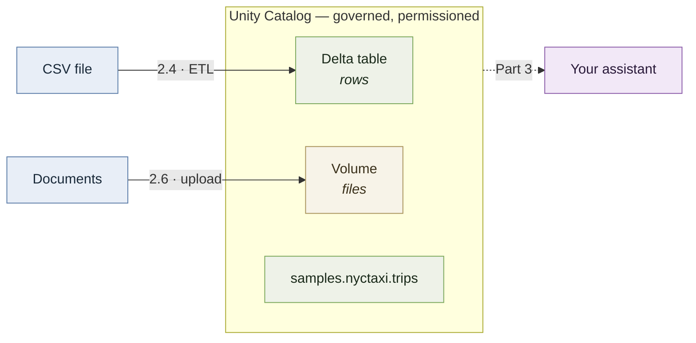

# Part 2 — Hands on

*About 5–7 hours. Everything here runs on the free tier.*

Part 1 was the shape of the problem. This part is where you actually touch the platform.

The goal is modest and specific: be able to say *"I've used Databricks notebooks to
process data"* and have it be true.

### How this part works

Databricks maintains good tutorials with current screenshots, and their interface changes
often enough that any click-by-click instructions written here would be wrong within
months. So this part **sends you to the official tutorial for each task**, and spends its
own words on the things those tutorials don't tell you: why you're doing it, what to
notice while you are, and how it connects to what you're building in Part 3.

Follow the linked tutorial. Come back for the explanation.

---

## 2.1 Get an account

Sign up for **Databricks Free Edition**:

- [Free Edition overview and signup](https://docs.databricks.com/aws/en/getting-started/free-edition)
- [Free trial vs. Free Edition](https://docs.databricks.com/aws/en/getting-started/free-trial-vs-free-edition) — read this first

That second link matters. Databricks offers two free things and they are not the same:

- **Free trial** — the full commercial platform, roughly $400 of credits, expires in about
  two weeks. Meant for companies evaluating a purchase.
- **Free Edition** — a limited version that is **free forever**, meant for learning.

**You want Free Edition.** A trial that expires halfway through this guide is exactly the
wrong thing.

### Read this before you run anything

> ⚠️ **Free Edition has daily usage quotas, and exceeding them shuts down your compute
> for the rest of the day — in extreme cases, the rest of the month.**
>
> There's no warning shot and no way to buy your way out. If you run something careless
> against a huge table on a Saturday morning, your Saturday is over.

This isn't a reason to be nervous, it's a reason to be deliberate. Two habits:

- **Put `LIMIT 100` on exploratory queries.** You're looking at the shape of the data, not
  reading all of it. There is no reason to scan a billion rows to find out what the
  columns are called.
- **Don't leave things running.** Serverless compute stops on its own after a while, but
  a query you started and forgot is still burning quota.

This connects directly to Part 1.3: **you're paying for compute now.** Not with your own
money on the free tier, but the discipline is the same one you'd need at work, and it's
better to build it here where the worst outcome is losing a Saturday.

### What Free Edition can't do

Worth knowing now so nothing later is confusing. You get:

- **Serverless compute only** — you cannot create your own clusters
- **One SQL warehouse**, at the smallest size
- **Python and SQL only** — no Scala, no R (tutorials often show tabs for those; ignore them)
- Limited model serving, no GPUs
- Restricted outbound internet access — this one shapes the project in Part 3
- Non-commercial use only

The full list is in [Free Edition limitations](https://docs.databricks.com/aws/en/getting-started/free-edition-limitations),
and there's a condensed version in [reference/free-edition-limits.md](reference/free-edition-limits.md).

The serverless-only restriction is the one that bites: **several official Databricks
tutorials begin by telling you to create a cluster, which you cannot do.** Those tutorials
aren't broken, they're just written for paid workspaces. This guide only sends you to ones
that work on Free Edition. If you go wandering and hit "create a compute cluster" as step
one, that's why.

---

## 2.2 Take the tour

**Do this:** [Get Started with Databricks Free Edition](https://www.databricks.com/training/catalog/get-started-with-databricks-free-edition-4486)
— free, about 30 minutes, two guided notebooks.

This is Databricks teaching you their own interface, which they're better positioned to do
than anyone. It covers the workspace layout, running Python and SQL in notebooks, and the
Unity Catalog objects from Part 1.5 — catalogs, schemas, tables, and volumes.

**What to notice while you're in there:**

- **The three-level naming** — `catalog.schema.table`. You met this in Part 1.5. Seeing
  it in the interface makes it concrete.
- **Where the compute indicator is.** Something has to be running for a cell to execute.
  On Free Edition it's serverless, so you attach to it rather than configuring it.
- **That a notebook mixes languages.** A SQL cell and a Python cell can sit in the same
  document and operate on the same data. That's normal here and takes some getting used to.

---

## 2.3 Query something real

**Do this:** [Query and visualize data](https://docs.databricks.com/aws/en/getting-started/quick-start)

You'll query `samples.nyctaxi.trips` — a table of New York City taxi rides that ships with
every Databricks workspace, in the `samples` catalog. It's real data with real messiness,
which makes it much better practice than anything invented for a tutorial. Other sample
datasets are listed in [the sample datasets docs](https://docs.databricks.com/aws/en/discover/databricks-datasets)
if you want to poke around.

> **Remember this table.** In Part 3 you'll build something that writes these same queries
> for you. It'll mean more if you've written a few by hand first — so don't rush this,
> and try a couple of questions of your own beyond what the tutorial asks for.

### What a DataFrame is

The tutorial will have you write something like:

```python
df = spark.read.table("samples.nyctaxi.trips")
```

A **DataFrame** is a table held in memory: rows and columns, like a database table, except
you manipulate it with method calls instead of SQL.

```python
expensive = df.filter(df.fare_amount > 50).select("pickup_zip", "fare_amount")
```

That's a `WHERE` and a `SELECT`, written as Python. Everything you know about tables still
applies — filtering, grouping, joining, aggregating. Only the syntax is different.

> If you've used **pandas** — the standard Python library for working with tables of data,
> common in data analysis and scientific work — a Spark DataFrame will look almost
> identical. If you haven't, you're not missing anything; the explanation above is all you
> need.

### Two ways Spark DataFrames differ, and why it matters

**They're lazy.** Nothing above actually ran. Spark builds up a plan of what you've asked
for and does nothing until you request results — with something like `display(df)` or
`.count()`. Then it looks at the whole chain of operations, optimises it, and runs it once.

This is why you can chain ten operations without worrying about ten passes over the data.
It's also why an error in your third line might not surface until your tenth.

**They're distributed.** This is the entire reason Spark exists. A pandas DataFrame lives
in one machine's memory, so it's limited by that machine. A Spark DataFrame is split across
many machines, each handling a slice, with results combined at the end.

You don't manage any of that. But it's why the same code works on a thousand rows and a
billion, and it's the answer if someone asks what Spark is actually for.

### And you can just use SQL

```python
spark.sql("SELECT pickup_zip, AVG(fare_amount) FROM samples.nyctaxi.trips GROUP BY 1")
```

Same engine, same result, same performance. DataFrames and SQL are two interfaces to one
thing — use whichever fits. Real data work mixes them constantly, and there's no purity
points for avoiding SQL.

---

## 2.4 Load your own data — your first ETL

**Do this:** [Import and visualize CSV data from a notebook](https://docs.databricks.com/aws/en/getting-started/import-visualize-data)

You'll take a CSV file, put it in a **volume**, read it into a DataFrame, fix a column
name, and save it as a table.

That sequence is **ETL** — the thing Part 1.6 described:

| | What you're doing |
|---|---|
| **Extract** | Reading the CSV out of the volume |
| **Transform** | Renaming the column, letting Spark infer types |
| **Load** | Writing it as a Delta table in Unity Catalog |

It's a small ETL. Every large one is the same three steps with more mess in the middle.

**What to notice:**

- **The file went to a volume; the table went to a catalog.** Two different places for two
  different things. More on that in 2.6.
- **The transform is the fiddly part.** Even here — one renamed column — it's the step that
  needed a decision. Remember the three-spellings-of-one-customer table from Part 1.6 and
  imagine that across two hundred sources.
- **You now have a Delta table**, which means it has the transactions, schema enforcement,
  and version history from Part 1.5. You didn't do anything special to get those; it's the
  default.

---

## 2.5 Governance in five minutes

**Do this:** [Create your first table and grant privileges](https://docs.databricks.com/aws/en/getting-started/create-table)

Short tutorial: create a table, then grant someone access to it.

It'll feel trivial, and on a workspace where you're the only user it *is* trivial. It's
here because it's the thing Part 4 argues actually matters, and because of something you'll
see in Part 3.

**What to notice:**

- **Permissions attach to catalogs, schemas, and tables** — the same three-level naming
  again. You can grant someone a whole catalog or a single table.
- **This is Unity Catalog doing its job** — the governance layer from Part 1.5.

> **Why this is here.** In Part 3 you'll build something that lets a language model run
> queries. The obvious worry is: *what stops it reading things it shouldn't?*
>
> The answer is this. The assistant connects with credentials, and those credentials have
> grants. It can see exactly what you've permitted and nothing else — not because the model
> is well-behaved, but because the platform won't serve it anything else.
>
> That's the entire enterprise AI security story in one sentence, and you'll have set it up
> yourself before you need it.

---

## 2.6 Load the other kind of data

**Do this:** [Work with unstructured data in volumes](https://docs.databricks.com/aws/en/volumes/unstructured-data-tutorial)
— **steps 1 through 5 only.**

Steps 6, 7, and 8 cover incremental ingestion, cross-organisation sharing, and cleanup.
They're real things, they're just past what you need. Stop after step 5.

You'll create a volume, upload files, query their metadata, read and process them, and
apply access controls.

### Why this section exists

Part 1.2 made a specific claim: a data warehouse can hold tables but **cannot hold a PDF,
a scanned contract, or a folder of documents** — and that limitation is why data lakes
exist, and ultimately why lakehouses do.

Up to now you've taken that on faith. This is where you stop taking it on faith. Load
documents into the same platform holding your taxi data, in the same catalog, under the
same permissions.

**For the files:** use the sample documents that come with this guide. If you haven't
already cloned the repository:

```bash
git clone https://github.com/cagrx/db-gpt.git
cd db-gpt
```

The documents are in [`poc/corpus/`](poc/corpus/) — twelve short policy pages for a
fictional company. Upload those. They're what your project will use in Part 3, so loading
them now means one less thing to do later.

Any handful of plain text or markdown files works if you'd rather use your own.

Use **markdown or plain text, not PDFs.** Extracting clean text from PDFs is a genuinely
annoying problem involving layout detection, columns, and tables, and solving it teaches you
nothing about Databricks or language models. It's a worthwhile thing to do *after* the rest
works.

### Volumes vs. tables

The distinction to take away:

| | Holds | Use it for |
|---|---|---|
| **Table** | Rows and columns | Structured data you query with SQL |
| **Volume** | Files, any format | Documents, images, audio, raw exports |

Both live in Unity Catalog. Both are governed by the same permissions. A volume is
addressed by a path:

```
/Volumes/your_catalog/your_schema/your_volume/handbook.md
```

Which reads like a filesystem path and behaves like one — you can point ordinary
file-reading code at it.

**The important part:** documents don't stay files for long. In Part 3 you'll read these
files, split them into chunks, and write them into a **table**. That's the same
extract-transform-load from 2.4, with prose instead of rows. Part 1.6 said a retrieval
pipeline is an ETL pipeline; this is the setup for seeing it.

### Optional: let SQL call a model

The tutorial demonstrates `ai_parse_document()` and `ai_query()` — functions that call a
language model **from inside a SQL query**, across every row of a table:

```sql
SELECT ai_summarize(document_text) FROM my_documents;
```

That's worth a moment, because it's the reverse of what you'll build in Part 3. There,
a model writes SQL. Here, SQL calls a model. Both are real patterns and they solve
different problems — Part 3.7 covers when you'd reach for which.

Whether these functions work on Free Edition depends on your region. The tutorial provides
plain-Python alternatives, so try it and move on if it doesn't work. Nothing later depends
on it.

---

## What you skipped, and why

If you go exploring Databricks' tutorials, you'll hit walls. These are the ones you'd hit
first, so you don't waste an afternoon:

| Tutorial | Why not |
|---|---|
| [Build an ETL pipeline using Apache Spark](https://docs.databricks.com/aws/en/getting-started/etl-quick-start) | Step 1 is "create an all-purpose compute cluster." Free Edition is serverless-only and cannot. You'd stall immediately |
| [dbdemos](https://github.com/databricks-demos/dbdemos) | An excellent installable demo library that needs cluster-creation permission. Same wall |
| [Query LLMs and prototype AI agents with no code](https://docs.databricks.com/aws/en/getting-started/gen-ai-llm-agent) | Needs features with limited regional availability. Worth trying if you're curious, but don't count on it |

The ETL tutorial is the frustrating one, because ETL genuinely matters. That's why Part 1.6
taught it properly and 2.4 had you do a small one — the concept isn't skipped, only that
particular tutorial.

---

## Where you are now



Both kinds of data from Part 1, on the platform, put there by you — plus a sample table
you didn't have to load at all.

---

> ### Checkpoint
>
> You should have, in your own workspace:
>
> 1. A **Delta table** you created from a file you chose
> 2. A **volume** holding documents
> 3. A few **queries you wrote yourself** against `samples.nyctaxi.trips`
>
> And you should be able to answer:
>
> - What's the difference between a volume and a table, and when would you use each?
> - Why is a Spark DataFrame different from a table in MySQL?
> - If you gave someone access to your workspace, what would stop them reading a table you
>   didn't want them to see?
>
> That last one is the setup for Part 3. If it's fuzzy, revisit 2.5 — it's five minutes and
> it's the foundation of everything the next part builds.

---

**Next:** [Part 3 — How the LLM plugs in](03-how-the-llm-plugs-in.md), where you build
something that queries all of this in plain English.
