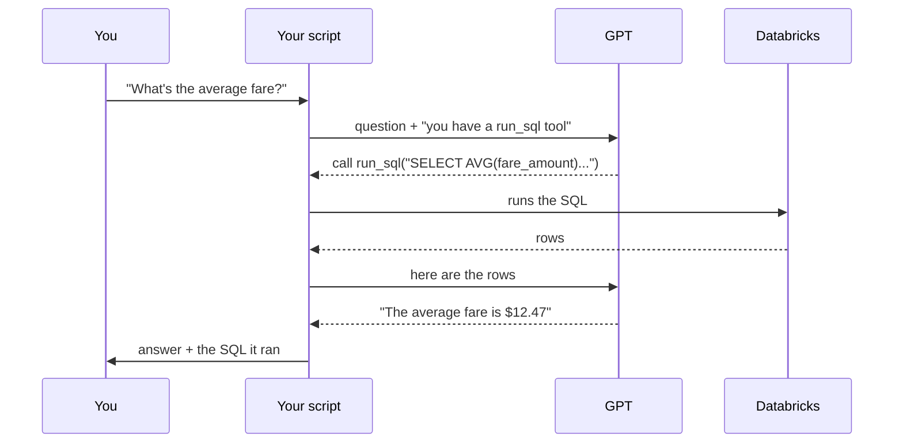
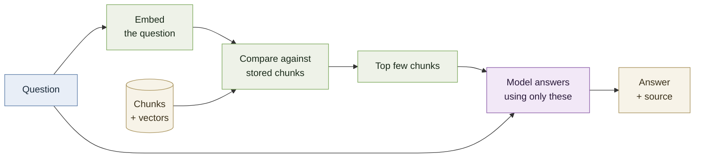

# Part 3 — How the LLM plugs in

*About 6–8 hours. Concepts first, then you build something.*

In Part 2 you queried a table of taxi trips by hand. By the end of this part, you'll have
built something that writes those queries for you — you ask in English, it answers.

That's a fun demo. It's also the clearest possible illustration of why these two
technologies are discussed together, which is what Part 4 is about.

---

## 3.1 Why GPT can't answer questions about your company

Ask a language model about your company's data and it will answer confidently and be
completely wrong. Not because it's badly built, but because **it has never seen your
data.** It was trained on public text. Your taxi table, your handbook, and your customer
records were not in it.

Worse, it won't say so. Asked for last quarter's revenue, a model will often produce a
plausible-looking number, because producing plausible text is what it does. This is
usually called **hallucination**, and in an enterprise setting it's the whole problem.

There are three ways to fix it, and it's worth knowing why two of them are wrong first.

### Wrong answer one: train your own model

Enormously expensive, needs a research team, and produces something worse than what you
can rent. Almost nobody should do this.

### Wrong answer two: fine-tune a model on your data

**Fine-tuning** means taking an existing model and continuing its training on your own
text, adjusting its weights. It sounds right — teach the model your data — and it's the
first idea most people have.

It's usually wrong here, for three reasons:

- **It goes stale.** Your data changes hourly. Retraining doesn't.
- **It can't cite anything.** The information dissolves into weights. There's no way to
  ask "where did that come from?"
- **It's bad at facts.** Fine-tuning is effective for teaching a model a *style, format,
  or task*. It's a poor way to install specific retrievable facts.

Fine-tuning has real uses. "My model doesn't know about my data" is not one of them.

### The right answer: give the model the data at question time

Don't change the model. Change what you put in front of it.

The model has a **context window** — the text it can consider in a single request,
including your question and everything you've given it to work with. Modern windows are
large. So: figure out which small slice of your data is relevant to the question, put that
slice in the request, and ask the model to answer using it.

Nothing is retrained. The model is doing what it's genuinely excellent at — reading text
and writing a clear response — while the *facts* come from your systems.

This splits into two approaches depending on where the data lives:

| Your data is | The question is | The approach |
|---|---|---|
| **Structured** — tables, rows, numbers | "What's the average fare by zip?" | The model writes **SQL**, you run it |
| **Unstructured** — documents, prose | "What's our PTO policy?" | You **find relevant passages**, then give them to the model |

You'll build the first, then add the second. Enterprises need both, because their data is
both.

---

## 3.2 Tool calling — how a model reaches outside itself

Everything in this part rests on one mechanism, and it's much simpler than it sounds.

**A language model cannot do anything.** It can't run code, query a database, or call an
API. It reads text and writes text. That's the entire capability.

**Tool calling** works around this with an arrangement:

1. You tell the model, up front, "here are some functions you can use. Here's what each is
   named, what it does, and what arguments it takes."
2. You ask your question.
3. Instead of answering, the model may reply: *"I'd like you to run `run_sql` with this
   query."*
4. **You** run it. The model doesn't — it has no ability to. Your code does.
5. You send the result back.
6. Now the model answers, using what came back.



The critical detail: **step 4 is yours.** The model asks; your code decides whether to
comply. That's where every guardrail lives — checking the query is read-only, capping
returned rows, refusing anything suspicious. The model has no privileges of its own. It
only has the privileges your code chooses to exercise on its behalf.

That's also the answer to the reasonable worry *"you're letting an AI run queries on a
database?"* You aren't. You're letting it **suggest** queries, and running the ones that
pass your checks with credentials you control.

The full mechanics are in OpenAI's
[function calling guide](https://developers.openai.com/api/docs/guides/function-calling).

---

## 3.3 Build Stage 1 — the analytics assistant

### Where the work happens

You're about to leave Databricks and write Python on your own machine. After a whole part
spent in notebooks, that deserves an explanation.

> **Notebooks are for working on data inside the platform. Application code lives outside
> it and connects in.**

That's how these systems are genuinely built. Transformation, pipelines, and analysis run
on the platform where the data and the compute are. The *application* — the thing with a
user — is separate software that connects to the platform like any other client.

There's a practical reason too: Free Edition restricts outbound internet access, so a
notebook probably can't reach the OpenAI API. But even on a paid workspace with no such
limit, this is the right shape. And it means you end up with a real repository you can
run, show, and put on GitHub, rather than a screenshot of a notebook.

### Step 0 — look at the data first *(in Databricks)*

Open a notebook and run [`poc/notebooks/01_explore_schema.py`](poc/notebooks/01_explore_schema.py).

You're going to tell a model what's in this table. You can't do that until you know
yourself.

Find out: what columns exist and what type each is, what one row represents, and something
untidy about the data. That last one matters — `samples.nyctaxi.trips` contains trips with
zero distance and non-positive fares. When your assistant returns a strange average later,
this is why, and knowing it in advance is the difference between debugging and confusion.

> **Column names lie.** `fare_amount` could be dollars or cents. `pickup_zip` could be a
> number or a string with leading zeros. Look at actual rows before assuming.

### Step 1 — connect from your laptop

```bash
cd poc
pip install -r requirements.txt
cp .env.example .env
```

You need four values. Two come from your SQL warehouse's **Connection details** tab
(server hostname and HTTP path). One is a personal access token from **Settings →
Developer → Access tokens**. The fourth is an OpenAI API key.

> **A token is a live credential.** Anyone holding it can do anything you can do in that
> workspace. `.env` is git-ignored in this repository and should stay that way. If you
> ever paste one into a commit, a chat message, or a screenshot, revoke it immediately —
> revoking is free and takes seconds.

Then prove the pipe works **before involving any AI**:

```python
from databricks import sql
import os

with sql.connect(
    server_hostname=os.environ["DATABRICKS_SERVER_HOSTNAME"],
    http_path=os.environ["DATABRICKS_HTTP_PATH"],
    access_token=os.environ["DATABRICKS_TOKEN"],
) as connection:
    with connection.cursor() as cursor:
        cursor.execute("SELECT count(*) FROM samples.nyctaxi.trips")
        print(cursor.fetchall())
```

If that prints a number, the hard part of the plumbing is done. If it doesn't, fix it now
— debugging a connection is much easier without a language model in the middle.

### Step 2 — tell the model what exists

Here's the entire trick behind text-to-SQL, and it's worth sitting with because it looks
like magic and isn't:

**You put the table and column names in the prompt.**

That's it. The model isn't inspecting your database. It doesn't have mysterious knowledge
of your schema. You fetch the column names and paste them into the instructions:

```python
cursor.execute("DESCRIBE TABLE samples.nyctaxi.trips")
```

…and the result becomes part of what you send. The model reads "there is a column called
`fare_amount` of type double" and writes SQL accordingly.

Once you've seen this, a whole category of AI product stops being mysterious. Most of them
are this: take something the model can't know, look it up, put it in the prompt.

### Step 3 — define the tool

```python
SQL_TOOL = {
    "type": "function",
    "name": "run_sql",
    "description": (
        "Run a read-only SQL query against Databricks and return the rows. "
        "Use this for anything involving numbers, counts, averages or aggregation."
    ),
    "parameters": {
        "type": "object",
        "properties": {
            "query": {"type": "string", "description": "A single SELECT statement."}
        },
        "required": ["query"],
    },
}
```

**The `description` is not documentation — it's instruction.** It's how the model decides
whether to reach for this tool. A vague description produces a model that uses the tool at
the wrong moments. This is prompt engineering in its most concrete form: the words you
choose change the behaviour.

### Step 4 — guardrails

The model proposes a query. Before it goes anywhere near Databricks:

```python
BANNED = re.compile(
    r"\b(insert|update|delete|drop|alter|create|merge|truncate|grant|revoke|copy)\b",
    re.IGNORECASE,
)

def is_read_only(query: str) -> bool:
    q = query.strip().rstrip(";")
    if ";" in q:            # no stacked statements
        return False
    if not re.match(r"^(select|with)\b", q, re.IGNORECASE):
        return False
    return not BANNED.search(q)
```

Three rules: it must start with `SELECT` or `WITH`, it must not contain a second statement
after a semicolon, and it must not contain a destructive keyword.

This is deliberately blunt, and it will sometimes reject a query that was fine — one
containing the word "update" inside a string literal, say. **That's the correct trade.** A
false rejection costs you one retry. A false acceptance costs you a table.

Also cap the rows you return. The model doesn't need fifty thousand rows to tell you the
average, and sending them costs money and time.

> **Would you ever give a language model write access?** Almost never, and never as a
> first design. If something must write, the pattern is to have it propose a change that a
> human approves, or restrict it to a specific reviewed function rather than arbitrary SQL
> — see 3.7.
>
> But notice what's actually protecting you here. It isn't this regex. It's the
> **permissions on the token you connected with** — the grants you set up in Part 2.5.
> Databricks will refuse to serve data the token isn't entitled to, no matter what SQL
> arrives. The guardrail is a seatbelt; the permissions are the brakes.

### Step 5 — the loop

Ask, and if the model requests a tool, run it and send the result back:

```python
for _ in range(6):     # bounded, so a confused model can't loop forever
    response = client.responses.create(
        model=MODEL, instructions=instructions, tools=tools, input=conversation
    )
    conversation += response.output

    calls = [item for item in response.output if item.type == "function_call"]
    if not calls:
        return response.output_text          # it's ready to answer

    for call in calls:
        result = run_sql(cursor, json.loads(call.arguments)["query"])
        conversation.append({
            "type": "function_call_output",
            "call_id": call.call_id,
            "output": json.dumps(result, default=str),
        })
```

Two details that matter more than they look:

**The loop is bounded.** Six passes, then it gives up. A model that keeps writing broken
SQL would otherwise retry forever, and you're paying per attempt.

**Errors go back to the model.** When a query fails, send the database's error message
back rather than crashing. Models are genuinely good at reading "column `fare` does not
exist" and trying `fare_amount` instead. Giving up on the first failure wastes that.

### Step 6 — show your work

Print every query before running it:

```
> Which pickup zip has the highest average fare?

  SQL: SELECT pickup_zip, ROUND(AVG(fare_amount), 2) AS avg_fare
       FROM samples.nyctaxi.trips
       GROUP BY pickup_zip ORDER BY avg_fare DESC LIMIT 1
```

This isn't decoration. It's the difference between a system someone will trust and a box
that emits numbers. Anyone who knows SQL can now check whether the question was answered
correctly, and when the answer looks wrong, the query tells you why.

**Design principle worth carrying beyond this project:** when a system produces an answer
through steps a human could verify, show the steps.

### Run it

```bash
python assistant.py
```

The finished version is [`poc/assistant.py`](poc/assistant.py). Try:

- *How many trips are there?*
- *What's the average fare?*
- *Which pickup zip has the highest average fare, among zips with at least 50 trips?*
- *What was the weather in Berlin yesterday?*

**That last one is the real test.** It should tell you it can't answer that from this
data. If it invents a weather report, your instructions aren't firm enough — and knowing
that your system declines gracefully is worth more than another feature.

---

## 3.4 Embeddings and vector search

Stage 1 handled structured data. But most of what a company knows isn't in tables — it's
in documents, tickets, contracts, and wikis. You can't `SELECT AVG()` your way to "what's
our parental leave policy?"

For that you need to find the relevant *passage*, which means searching by meaning rather
than by keyword.

### Why keyword search isn't enough

Someone asks *"how much time off do I get?"* The handbook says *"20 days of paid time off
per calendar year."* Keyword search for "time off" finds it.

Now they ask *"how many vacation days?"* The document never says "vacation." Keyword
search finds nothing, and the answer was right there.

### Embeddings

An **embedding** is a list of numbers representing a piece of text's meaning. You send text
to a model, you get back a few thousand numbers — a **vector**.

The useful property: **text with similar meaning produces similar vectors.** "Vacation
days" and "paid time off" land near each other, despite sharing no words. That's the whole
idea, and it's what makes meaning-based search possible.

```python
response = client.embeddings.create(model="text-embedding-3-small", input=texts)
```

You don't need to know how the numbers are produced. You need to know that closeness in
this space means closeness in meaning.

### Vector search, demystified

"Vector database" sounds like serious infrastructure. Here is the entire concept:

```python
def cosine(a, b):
    dot = sum(x * y for x, y in zip(a, b))
    norm_a = sum(x * x for x in a) ** 0.5
    norm_b = sum(y * y for y in b) ** 0.5
    return dot / (norm_a * norm_b)
```

**Cosine similarity.** 1.0 means identical direction, 0.0 unrelated. To search: embed the
question, compare against every stored chunk, take the highest scoring few.

That's it. That's what a vector database does.

What the real ones — Databricks Vector Search, pgvector, Pinecone — add is *speed at
scale*. Comparing against 20 chunks takes no time. Against 50 million, comparing every one
is too slow, so they use index structures that find approximate nearest neighbours without
checking everything.

**They are faster, not cleverer.** Knowing that means you'll never be intimidated by the
category, and you'll know when you don't need one — which, for a project of this size, is
now.

### Chunking, and why it exists

You don't embed whole documents. You split them into **chunks** of a few hundred words and
embed each.

Two reasons. A single vector for a 5,000-word document is a blurry average of everything
in it, matching nothing precisely. And when you find a match, you send that text to the
model — you want the relevant paragraph, not the whole handbook.

Two decisions determine whether retrieval works:

- **Chunk size.** Too large and you send irrelevant text alongside the useful sentence.
  Too small and you cut sentences off from the context that gives them meaning.
- **Overlap.** Chunks share some words with their neighbours, so a fact landing on a
  boundary still appears whole somewhere. Without overlap, the single most important
  sentence in a document can be split across two chunks and match neither.

---

## 3.5 RAG, assembled

Put those pieces together and you get the pattern the entire industry runs on:

1. **Retrieve** — find the chunks most relevant to the question
2. **Augment** — put them into the prompt alongside the question
3. **Generate** — the model answers using them

**Retrieval-Augmented Generation.** The name describes the steps exactly, which is unusual
for this field.



### Citations are the point

Notice the last box. Because you know which chunks you retrieved, you know which documents
the answer came from — so you can show them.

This is why RAG won over fine-tuning for this problem. Not accuracy alone: **traceability.**
An answer nobody can verify is nearly worthless in a company, because the first question
anyone asks about a surprising result is "says who?" A system that answers "according to
`parental-leave.md`" is usable. One that answers confidently from nowhere is a liability.

It also means updating your data means re-running a pipeline, not retraining a model.

---

## 3.6 Build Stage 2 — give it a second tool

### Load the documents *(in Databricks)*

You already put the handbook documents in a volume in Part 2.6. Now turn them into a
table: run [`poc/notebooks/02_chunk_documents.py`](poc/notebooks/02_chunk_documents.py).

Read the files, split into chunks, write a Delta table of `doc_name`, `chunk_id`,
`chunk_text`.

**Notice what that is.** Extract the files, transform them into chunks, load a table.
It's the same ETL from Part 1.6 and Part 2.4, with prose instead of rows. A retrieval
pipeline is an ETL pipeline — that's not an analogy, it's the same three steps.

You're back in a notebook because this is data work, and by now that should feel obvious
rather than arbitrary.

### Add the tool *(on your laptop)*

Set `DATABRICKS_CHUNKS_TABLE` in `.env` and the assistant gains a second tool:

```python
DOCS_TOOL = {
    "type": "function",
    "name": "search_documents",
    "description": (
        "Search company policy documents for passages relevant to a question. "
        "Use this for questions about policy, process or rules rather than numbers."
    ),
    ...
}
```

Embeddings are computed once and cached, so you pay for them a single time. For this
corpus that's a fraction of a cent.

### The moment it clicks

Now ask two questions in a row:

```
> What's the average fare for trips over 5 miles?
> How many days of paid time off do I get?
```

Nobody told it which tool to use. It read both descriptions and chose — SQL for the
numbers, document search for the policy. **That's what people mean by an "agent":** a
model that selects and calls tools to accomplish a goal, rather than just producing text.

You've now built something covering both halves of enterprise data. That's the whole
architecture, at small scale, and the shape doesn't change when the scale does.

---

## 3.7 The other ways to connect

Text-to-SQL is one path, not *the* path. Worth knowing the landscape, because "it
generates SQL" as your only answer sounds narrow.

**Two directions**, and this is the organising idea:

### Pull — the model reaches into Databricks

- **Text-to-SQL** — what you built. Flexible, needs guardrails.
- **Retrieval / RAG** — what you added. Finds text by meaning; no SQL involved.
- **Unity Catalog functions as tools** — instead of arbitrary SQL, the model calls
  *vetted, pre-written* functions registered in Unity Catalog. This is the serious answer
  to "isn't letting a model write SQL dangerous?" — a reviewed function called
  `revenue_by_region(quarter)` can't do anything unexpected, because someone wrote and
  approved exactly what it does.
- **MCP (Model Context Protocol)** — an open standard for connecting models to tools.
  Databricks offers managed, external, and custom MCP servers. You'll hear the term.

### Push — Databricks calls the model, over data at rest

This is the inverse, and it's the more distinctly Databricks idea.

```sql
SELECT ai_summarize(ticket_text) FROM support_tickets;
```

**AI Functions** — `ai_query`, `ai_classify`, `ai_extract`, `ai_summarize` — call a
language model *from inside a SQL statement*, across every row of a table. The platform
handles parallelism, retries, and scale.

Consider the difference. "What's our average fare?" is a question for an assistant.
**"Summarise every outage in the past six months"** is not a chatbot question at all —
it's batch inference over a table, and it's the kind of thing that's genuinely impractical
without a data platform underneath.

### Where GPT specifically fits

Databricks **External Models** and **AI Gateway** let you register OpenAI as a governed
endpoint inside Databricks: one place holding the API key, with rate limits, usage
tracking, and logging of what was sent.

That's how a company would actually wire this up — rather than every engineer holding a
personal key in a `.env` file, which is exactly what you're doing and is fine for a
project of this size. Worth knowing the grown-up version exists, and why it's shaped that
way: the problem it solves is governance, not capability.

### Choosing

| The question | The approach |
|---|---|
| Numbers over structured tables | Text-to-SQL |
| Meaning inside documents | Retrieval / RAG |
| Same transformation over millions of rows | Batch AI functions |
| A specific, repeated, sensitive operation | A vetted Unity Catalog function |

**Knowing which to reach for is the actual skill.** The individual techniques are not
difficult; choosing appropriately is what separates someone who's built one of these from
someone who's read about them.

---

## 3.8 Where the seam is

You've now seen both halves working together, so this should land:

**Databricks holds, cleans, and governs the data. The language model does language.**

The model brings no facts. It brings the ability to understand a question phrased how a
person would phrase it, translate that into a precise operation, and explain the result in
a sentence. Every fact came from your platform.

> *Without Databricks, GPT has nothing reliable to work with. Without GPT, Databricks is
> just an analytics platform.*

That sentence is the answer to "why do people mention these two things together?" — and
you've now built the smallest thing that demonstrates it.

---

> ### Checkpoint
>
> You should have a working assistant. Specifically, it should:
>
> 1. Answer a numerical question and **show the SQL it ran**
> 2. Answer a policy question **from the documents, citing which one**
> 3. **Decline** to answer something the data can't support
>
> That third one is not a lesser achievement than the first two. A system that knows what
> it doesn't know is the difference between a demo and something usable.
>
> And you should be able to explain, without notes:
>
> - What tool calling is, and who actually runs the query
> - Why fine-tuning is the wrong tool for "the model doesn't know my data"
> - What an embedding is, and what a vector database really does
> - Why the assistant prints its SQL

---

**Next:** [Part 4 — Why anyone wants this](04-why-anyone-wants-this.md), which is the
shortest part and the one that matters most.
