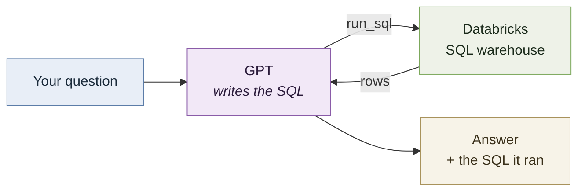

# Ask Databricks questions in plain English

A small assistant that answers questions about data in Databricks. You ask in English, it
writes SQL, runs it, and explains the result.

```
> What's the average fare by pickup zip code, for the ten busiest zips?

  SQL: SELECT pickup_zip, COUNT(*) AS trips, ROUND(AVG(fare_amount), 2) AS avg_fare
       FROM samples.nyctaxi.trips GROUP BY pickup_zip ORDER BY trips DESC LIMIT 10

The busiest pickup zip is 10001 with 1,289 trips averaging $12.47...
```

Built as the project for [this guide](../README.md).

## How it works



The model never sees your data — only the table and column names. It writes a query, this
script runs it against Databricks, and the rows come back for the model to interpret.

**The application runs on your machine, not in Databricks.** That's how these systems are
normally built: transformation and pipelines run on the platform, the application that
consumes the data lives outside it and connects in. It also sidesteps the fact that a
Free Edition notebook can't reach the OpenAI API.

## Setup

```bash
pip install -r requirements.txt
cp .env.example .env    # then fill it in
```

You need four values in `.env`:

| Variable | Where to find it |
|---|---|
| `DATABRICKS_SERVER_HOSTNAME` | SQL Warehouses → your warehouse → Connection details |
| `DATABRICKS_HTTP_PATH` | Same page |
| `DATABRICKS_TOKEN` | Settings → Developer → Access tokens → Generate new token |
| `OPENAI_API_KEY` | https://platform.openai.com/api-keys |

`.env` is git-ignored. Keep it that way — a Databricks token is a live credential to your
workspace, and an OpenAI key is attached to your billing.

## Run it

```bash
python assistant.py
```

Try:

- *How many trips are there in total?*
- *What's the average fare?*
- *Which pickup zip has the highest average fare, among zips with at least 50 trips?*
- *What was the weather like in Berlin yesterday?* — it should decline, not invent

## Stage 2 — add documents

Structured data is half the story. To let it answer policy questions from documents too:

1. Upload [`corpus/`](corpus/) to a Unity Catalog volume
2. Run [`notebooks/02_chunk_documents.py`](notebooks/02_chunk_documents.py) in Databricks
   to turn those files into a table of text chunks
3. Set `DATABRICKS_CHUNKS_TABLE` in `.env`

The assistant picks up a second tool and starts choosing between them — numbers go to SQL,
policy questions go to the documents.

Try: *How many days of paid time off do I get?* and *What's the meal expense limit?*

## Guardrails

`run_sql` only accepts a single `SELECT` (or `WITH … SELECT`). Statements that are stacked
with a semicolon, or that contain `INSERT`, `UPDATE`, `DELETE`, `DROP`, `CREATE` and
similar, are rejected before they reach Databricks.

The check is deliberately blunt and will occasionally reject a legitimate query — a string
literal containing the word "update", for instance. That's the correct trade: a false
rejection costs one retry, a false acceptance costs a table.

**The real protection is not this function.** It's the permissions on the token you
connected with. The assistant can read exactly what you granted it and nothing else, and
that's enforced by Databricks rather than by anything in this file. Give it a token scoped
to only what it needs.

## What it doesn't do

- **No write access, by design.** It reads.
- **No conversation memory between questions.** Each question starts fresh, so follow-ups
  like "now break that down by month" won't work.
- **Chunk embeddings are cached in `.cache/`** and won't refresh if you change the
  documents. Delete the folder to rebuild.
- **It can be wrong.** It writes plausible SQL, not guaranteed-correct SQL. That's why it
  prints every query it runs — read them.

## Files

| | |
|---|---|
| `assistant.py` | The whole application |
| `notebooks/01_explore_schema.py` | Run first, in Databricks — look at the data |
| `notebooks/02_chunk_documents.py` | Stage 2 — documents into a table |
| `corpus/` | Sample handbook documents for a fictional company |
