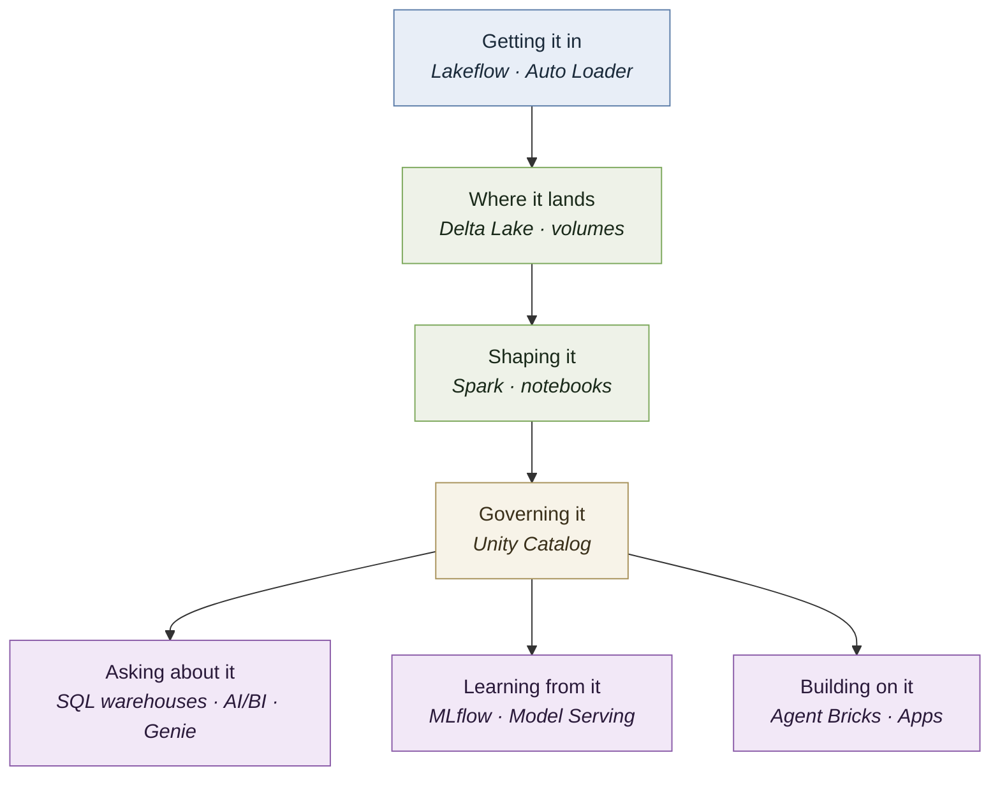

# A map of Databricks

Databricks has a lot of branded products, and the names change. This page follows a single
piece of data from arriving to being answered about, naming what handles it at each stage —
so when someone says "Lakeflow" or "Unity Catalog" in a meeting, you know which part of the
picture they're pointing at.

> **This page will go stale, and faster than the rest of the guide.** Product names here
> were checked in July 2026, and Databricks renames and rebrands often. The *layers* are
> stable; the *names* are not. When something doesn't match, trust
> [Databricks' own product pages](https://www.databricks.com/product/data-intelligence-platform)
> and treat this as orientation.

---

## Follow one delivery record

Take the retailer from Part 1.1. A delivery is completed at store 214. Here's everything
that touches that record on its way to answering *"which stores had the worst delays last
quarter?"*

---

## 1. Getting it in

The record starts in the warehouse management system, which knows nothing about
Databricks. Something has to fetch it.

**Lakeflow** is the umbrella name for Databricks' data engineering tooling. Underneath it:
**Lakeflow Connect** pulls from source systems, **Lakeflow pipelines** define the
transformation steps and work out what has to run in which order, and **Lakeflow Jobs**
schedules the whole thing. **Lakeflow Designer** is a drag-and-drop, natural-language
pipeline builder aimed at people who don't write code.

**Auto Loader** handles the specific and very common case of files landing continuously in
cloud storage — it keeps track of what it has already processed so you don't reprocess
yesterday's files every night.

*If you've heard "Delta Live Tables", this is where it lived; the branding moved under
Lakeflow.*

## 2. Where it lands

The record is now a row in a table, but the table is really a pile of files in cheap cloud
storage with a transaction log on top.

**Delta Lake** is that layer — it's what gives files the transactions, schema enforcement,
and version history a database would have given you. **Apache Iceberg** is the competing
format, and Databricks reads and writes it too.

**Volumes** hold everything that isn't a table: PDFs, images, raw exports. Files rather
than rows.

**Lakebase** is newer and different — a Postgres database integrated into the platform, for
the transactional (OLTP) workloads a lakehouse is bad at. Useful when an application needs
to write single rows quickly rather than scan billions.

## 3. Shaping it

Raw delivery records aren't answerable yet. Timestamps disagree, store IDs are formatted
three ways, some rows are duplicated.

**Apache Spark** does the work — splitting the job across machines and combining results.
You write it in **notebooks**, or as code in a job.

This is the ETL from Part 1.6, and it's where most engineering time goes.

## 4. Governing it

Now the record is clean and someone has to decide who may see it, and prove it later.

**Unity Catalog** is the governance layer: permissions on catalogs, schemas, tables and
columns; automatic **lineage** showing which tables were built from which; and the
descriptions and tags that make data discoverable — by people and, increasingly, by agents.

**Metric views** live here too. They're the semantic layer from Part 3.8: "on-time delivery
rate" defined once, correctly, so nobody recomputes it three different ways.

**Delta Sharing** handles giving data to another organisation without copying it.

Everything downstream inherits whatever is decided here — which is the whole argument of
Part 4.3.

## 5. Asking about it

**SQL warehouses** are compute sized for queries. The **SQL editor** is where an analyst
writes them, and **AI/BI dashboards** are where the results get published.

**Genie** is the natural-language layer: you scope a space to a curated set of tables, add
instructions and example queries, and business users ask questions in plain English.
**Genie One** is the current generation, with **Genie Ontology** supplying the business
context that grounds its answers. **Genie Code** extends the same idea to writing data code
rather than just queries.

**This is the managed version of what you built in Part 3.** Worth setting one up over the
same table just to compare.

## 6. Learning from it

Before language models, this was the AI story, and it's still most of production machine
learning.

**MLflow** tracks experiments, parameters and models — created at Databricks, now a Linux
Foundation project. **Mosaic AI** is the umbrella for the model training and serving
tooling. **Model Serving** puts a trained model behind an endpoint something can call.

## 7. Building AI on it

**Vector Search** is the managed vector index — the scaled version of the cosine similarity
you wrote by hand.

**AI Functions** (`ai_query`, `ai_classify`, `ai_summarize`, `ai_extract`) call a language
model from inside a SQL statement, across every row. The push direction from Part 3.7.

**External Models** and **AI Gateway** let you register an outside provider — OpenAI,
Anthropic — as a governed endpoint, so one place holds the key with rate limits and
logging.

**Agent Bricks** is the platform for building custom agents on governed data, when a Genie
space isn't enough. **MCP** support lets agents discover tools through the open standard
rather than having them hard-coded.

## 8. Building on top

**Databricks Apps** hosts a small application — a Streamlit or Dash interface — inside the
workspace, with the platform's identity and permissions already wired in. It can embed a
Genie Agent as a component.

---

## What you actually touched

Of everything above, this guide had you use six things:

| | Where |
|---|---|
| **Notebooks** | Part 2, throughout |
| **Delta Lake** tables | 2.4 — created without you having to ask for it |
| **Volumes** | 2.6 — the handbook documents |
| **Unity Catalog** | 2.5 — grants; and every three-part table name you typed |
| **SQL warehouses** | 2.7 and Part 3 — what your laptop connected to |
| **Spark** | 2.3, 2.4, and the chunking notebook |

Everything else on this page is context. You don't need it to finish, and you shouldn't
claim familiarity with tools you haven't opened.

---

## Quick lookup

| Name | What it does |
|---|---|
| **Delta Lake** | Table format — transactions, schema enforcement, versions over cheap storage |
| **Apache Iceberg** | The competing open table format; Databricks supports it too |
| **Apache Spark** | Distributed processing engine |
| **Unity Catalog** | Governance — permissions, lineage, discovery, metric views |
| **Volumes** | Storage for files rather than rows |
| **Lakeflow** | Data engineering: Connect, pipelines, Jobs, Designer |
| **Auto Loader** | Incremental ingestion of files arriving in cloud storage |
| **Notebooks** | The interactive working surface |
| **SQL warehouses** | Compute sized for SQL queries |
| **AI/BI dashboards** | Published reports and visualisations |
| **Genie** | Natural-language questions over curated tables |
| **Metric views** | Business definitions declared once, in the catalog |
| **MLflow** | Experiment and model tracking |
| **Mosaic AI** | Umbrella for model training and serving |
| **Model Serving** | Trained models behind callable endpoints |
| **Vector Search** | Managed vector index for retrieval |
| **AI Functions** | Call a model from inside SQL, across a table |
| **External Models / AI Gateway** | Outside providers as governed endpoints |
| **Agent Bricks** | Building custom agents on governed data |
| **Databricks Apps** | Hosting small applications in the workspace |
| **Lakebase** | Integrated Postgres for transactional workloads |
| **Delta Sharing** | Sharing data across organisations without copying |

---

## Names you may hear that aren't covered here

Not because they don't matter, but because a new graduate is unlikely to meet them early:
**Delta Sharing Marketplace**, **Clean Rooms** (joint analysis between companies without
exposing raw data), **Lakehouse Federation** (querying external databases in place),
**Lakehouse RT** (a newer low-latency analytics engine), and **Declarative Automation
Bundles** (deploying workspace resources as code).

If one comes up, the honest answer is better than a guess: *"I haven't used that — what
does it do in your setup?"* Nobody expects a new graduate to know a vendor's entire
catalogue, and asking reads better than bluffing.
